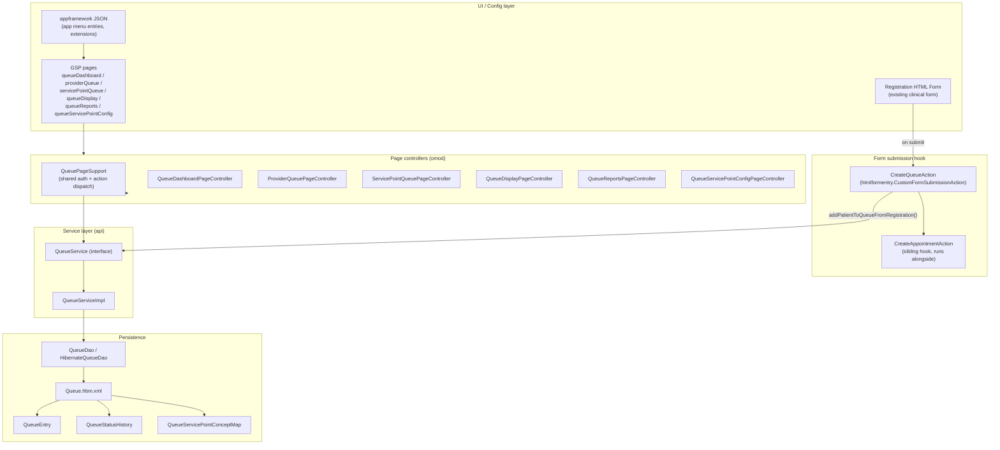

# Queue Management & Self-Registration Routing

Branch: `SELF-REGISTRATION-QUEUE`
Module: `rwandaemr` (this module)

This document explains the patient queue system: how a patient gets into a
queue automatically from registration, how staff work through queues, and
how that relates to the underlying OpenMRS Visit lifecycle.

## 1. What this feature actually does

A patient completes a **registration form** (front desk, or a self-service
kiosk) and picks what they came for — a coded field usually referred to as
**"Service Requested"** (e.g. "General Consultation", "Lab Test",
"Pharmacy"). The moment that form is submitted, the system:

1. Looks up which physical location ("**service point**", e.g. *Triage*,
   *Consultation Room 2*, *Pharmacy*) that requested service maps to.
2. Creates a `QueueEntry` for the patient at that service point, with a
   generated ticket number, no staff action required.
3. Makes that entry visible on staff dashboards (filtered to their login
   location) and on a patient-facing "Queue Display" screen.

Staff then call patients, start/complete their service, or transfer them to
another service point (e.g. Triage → Consultation → Lab) — each transfer
creates a new "leg" of the queue journey, keeping a link back to where the
patient came from.

**Note:** this module's queue system is entirely independent from the
OpenMRS `Visit` closing mechanism. A patient's last queue entry reaching
`COMPLETED` does **not** close their Visit — that happens later, in the
background, based on staleness (see [§6](#6-how-this-relates-to-the-openmrs-visit-lifecycle)).

## 2. Architecture



### Layer-by-layer reference

| Layer | Files | Responsibility |
|---|---|---|
| **Registration hook** | `api/.../htmlformentry/CreateQueueAction.java` | Fires when a *registration*-type encounter is submitted. Reads the "Service Requested" observation, calls `QueueService.addPatientToQueueFromRegistration()`. Also triggers `CreateAppointmentAction`. Wrapped in try/catch so a queue/appointment failure never blocks registration itself. |
| **Service interface** | `api/.../queue/QueueService.java` | The full contract: create-from-registration, call/start/complete/transfer/hold/cancel, priority updates, status history, service-point-concept mapping CRUD. |
| **Service impl** | `api/.../queue/QueueServiceImpl.java` | All business logic and validation (e.g. "destination must be tagged Login Location", "no duplicate active entry at the same service point"). |
| **Domain model** | `api/.../queue/model/QueueEntry.java` | patient, visit, encounter, servicePoint, previousServicePoint, serviceRequestedConcept, assignedProvider, priority, status, queueNumber, and the full arrival→called→start→end→completed timestamp trail. |
| | `api/.../queue/model/QueueStatusHistory.java` | Audit trail — one row per status transition. |
| | `api/.../queue/model/QueueServicePointConceptMap.java` | Admin-configured mapping: which "Service Requested" concept routes to which service-point Location. |
| **Enums** | `api/.../queue/QueueStatus.java` | `WAITING, CALLED, IN_PROGRESS, ON_HOLD, TRANSFERRED, COMPLETED, CANCELLED` |
| | `api/.../queue/QueuePriority.java` | `EMERGENCY(0) < ELDERLY(10) < PREGNANT(20) < CHILD(30) < DISABILITY(40) < NORMAL(100)` — lower number = seen first. |
| | `api/.../queue/QueuePrivileges.java` | `View`, `Manage`, `Call Patient`, `Transfer Patient`, `Configure`, `Reports`, `View All Locations`. |
| **Persistence** | `api/.../queue/dao/QueueDao.java` + `HibernateQueueDao.java`, `api/src/main/resources/Queue.hbm.xml` | Hibernate mapping and query methods (by location, by service point, by visit, counts for ticket numbering). |
| **Page controllers** | `omod/.../page/controller/queue/*.java` | One controller per UI surface — see §4. |
| **App menu / config** | `omod/src/main/resources/appconfig/appframework/rwandaemrQueue_app.json`, `.../appframework/rwandaemr-queue-extension.json` | Registers each queue page as an app-framework app with a required privilege and homepage link. |
| **Pages** | `omod/src/main/webapp/pages/queue/*.gsp` | The actual UI markup for each screen. |

## 3. Step-by-step: from registration to a completed queue entry

1. **Patient registers.** A registration encounter is submitted (this is an
   *existing* clinical registration form — this module doesn't add a new
   registration form, it hooks into the existing one via encounter type).
2. **`CreateQueueAction.applyAction()` fires** (registered as a
   `CustomFormSubmissionAction` on that form). It checks:
   - Is this actually a registration-type encounter? (compares
     `encounter.getEncounterType()` against the configured registration
     type — if not, skip silently.)
   - Is there a "Service Requested" observation with a coded value? If
     missing, skip (logged at `info`, not an error — many registrations
     won't have this field filled in, e.g. non-self-registration flows).
3. **Resolve the service point.** `resolveServicePointForRegistration()` →
   `resolveServicePointFromServiceRequestedConcept()` looks up the
   `QueueServicePointConceptMap` for that concept. The mapped Location
   **must** be tagged `Login Location` — if it isn't (misconfiguration), the
   queue entry is skipped and a warning is logged rather than failing
   registration.
4. **Duplicate check.** If the patient already has an active queue entry at
   that same service point today, the existing entry is returned instead of
   creating a second one (`getActiveQueueEntry(patient, servicePoint, now)`).
5. **Queue entry created:**
   - `status = WAITING`, `priority = NORMAL` (default — priority can be
     escalated later by staff via `updatePriority()`)
   - `queueNumber` generated: `<SERVICEPOINT-CODE>-<yyyyMMdd>-<sequence>`,
     e.g. `TRIAG-20260810-004` — sequence resets daily per service point.
   - `arrivalTime = now`
   - A `QueueStatusHistory` row is written: `null → WAITING, "Created from registration"`.
6. **Appointment step runs alongside** (`CreateAppointmentAction`) —
   separate concern, capacity-based scheduling, not required for the queue
   to function.
7. **Patient is now visible:**
   - On the **Queue Display Screen** (patient-facing, shows ticket numbers
     being called) for that service point.
   - On the **Service Point Queue** / **Provider Queue** (staff-facing,
     scoped to the staff member's current login location) — sorted by
     priority weight, then arrival time.
   - On the **Queue Dashboard** (cross-location admin view, requires
     `View All Locations`).
8. **Staff calls the patient** — either `callNextPatient()` (pulls the
   front of the WAITING list for a service point) or `callPatient()`
   directly on a specific entry. Sets `status = CALLED`, `calledTime = now`,
   and (from the page controller) opens the patient's clinical dashboard.
   - There's also `callPatientAfterVitals()` — used when a vitals encounter
     was just recorded for that patient/visit; validates the vitals belong
     to the same patient+visit before calling.
9. **Staff starts service** — `startService()`: `status = IN_PROGRESS`,
   `serviceStartTime = now`.
10. **Staff completes service** — `completeService()`: `status = COMPLETED`,
    `serviceEndTime` and `completedTime = now`. This is the terminal happy
    path for one "leg" of the patient's journey.
11. **...or staff transfers the patient** to a different service point
    (e.g. Triage → Consultation) — `transferPatient()`:
    - Validates the destination is a different, `Login Location`-tagged
      service point, and that the patient doesn't already have an active
      entry there.
    - Records `previousServicePoint` = the old service point (so the
      journey is traceable).
    - Generates a **new** ticket number at the destination and resets
      `arrivalTime`.
    - **Special case:** if the destination is a *laboratory* service point,
      the entry skips the waiting room entirely — it's set straight to
      `IN_PROGRESS` with `serviceStartTime = now` and auto-assigns the
      current provider if none is set. Anywhere else, it resets to
      `WAITING` with a clean slate (no provider, no timestamps) at the new
      location.
12. **Side paths:** `putOnHold()` (`ON_HOLD`, patient stepped away),
    `cancelQueueEntry()` (`CANCELLED`, requires `Manage` privilege),
    `markPatientTransferred()` (used to explicitly close out an entry when
    a `transferapp`-style facility-to-facility transfer happens, distinct
    from an internal service-point transfer).
13. **Every transition** (steps 8–12) writes another `QueueStatusHistory`
    row — the full journey is reconstructable end to end.
14. **Reporting.** `QueueReportsPageController` + `QueueReportExcel`
    aggregate entries by location/date range and export to Excel.
    `QueueWaitingTime` and `LatestVitalsSummary` compute derived metrics
    (e.g. how long patients waited, most recent vitals per entry) for the
    dashboard.

## 4. UI surfaces (who sees what)

| Page | Controller | Audience | Required privilege |
|---|---|---|---|
| Queue Dashboard | `QueueDashboardPageController` | Admin / cross-location | `View` (+ `View All Locations` to see beyond your own) |
| My Location Queue | `ProviderQueuePageController` | Clinical staff, scoped to their login location | `View` |
| Service Point Queue | `ServicePointQueuePageController` | Staff at a specific service point | `View` |
| Queue Display Screen | `QueueDisplayPageController` | **Patients** (waiting-room screen) | `View` |
| Queue Service Point Mappings | `QueueServicePointConfigPageController` | Admin | `Configure` |
| Queue Reports | `QueueReportsPageController` | Admin / management | `Reports` |

Action buttons on staff-facing pages (`start`, `complete`, `hold`, `cancel`,
`transfer`, `updatePriority`) all route through `QueuePageSupport.processEntryAction()`,
which dispatches to the matching `QueueService` method — this is the single
choke point for every state change, which is why the audit trail in
`QueueStatusHistory` is complete.

## 5. Priority ordering

```
EMERGENCY (0)  →  seen first
ELDERLY   (10)
PREGNANT  (20)
CHILD     (30)
DISABILITY(40)
NORMAL    (100) →  seen last, default for everyone unless escalated
```

New entries always start at `NORMAL`. Staff can escalate via
`updatePriority()` (e.g. a `NORMAL` patient who is visibly deteriorating
gets bumped to `EMERGENCY`). Queue lists are sorted by this weight first,
then by arrival time within the same priority.

## 6. How this relates to the OpenMRS Visit lifecycle

This is the part that's easy to assume incorrectly, so it's worth being
explicit: **completing every queue entry for a visit does not close the
Visit.** They are two separate mechanisms:

- **Queue completion** is per-service-point and per-encounter — it just
  means "this leg of today's journey is done."
- **Visit closing** is handled entirely separately by
  `RwandaEmrCloseVisitsTask` (`api/.../task/RwandaEmrCloseVisitsTask.java`),
  a scheduled background job (registered in `RwandaEmrScheduledTaskExecutor`,
  runs on a fixed interval — see the `rwandaemr.task.closeVisits.*` global
  properties for delay/period). It:
  1. Finds all Locations tagged `Visit Location`.
  2. Fetches all currently-open Visits at those locations.
  3. For each one, asks the standard `emrapi` `AdtService.shouldBeClosed(visit)`
     — this is **OpenMRS core/emrapi's own staleness logic** (typically:
     visit has been open longer than its configured expiry hours with no
     recent activity), not anything queue-specific.
  4. Closes any visit that qualifies via `AdtService.closeAndSaveVisit()`.

So the real end-to-end picture is:

```
Registration submitted
   → Queue entry created (WAITING)
   → Called → In Progress → Completed   (repeats per service point, via transfers)
   → [queue work for this visit is now finished]
   ... time passes, no further activity on the visit ...
   → RwandaEmrCloseVisitsTask (background, runs hourly-ish) notices the
     visit is stale and closes it independently
```

If you need the Visit to close *immediately* when the last queue entry
completes (rather than waiting for the background job), that would be a
new integration point — nothing in this branch currently wires
`completeService()` to `AdtService.closeAndSaveVisit()` directly.

## 7. Test coverage

`api/src/test/java/org/openmrs/module/rwandaemr/queue/QueueServiceImplTest.java`
(899 lines) covers the service layer extensively. `omod/src/test/.../queue/`
has focused tests for `LatestVitalsSummary`, `QueueReportExcel`,
`QueueVisitServicePoints`, `QueueWaitingTime`, and
`ServiceRequestedConceptOptions`. Worth running (`mvn test`) before making
changes here, and extending when you add new transitions or edge cases.

## 8. Where to look next

- **Admin config:** `QueueServicePointConfigPageController` +
  `queueServicePointConfig.gsp` — this is where the Service-Requested → Service-Point
  mapping actually gets configured. Nothing will route into a queue until
  at least one mapping exists here.
- **The registration form itself:** search `omod/src/main/webapp` /
  `htmlforms` (or the Initializer `configuration/htmlforms` in a deployed
  server) for the form that includes a "Service Requested" field tied to
  the registration encounter type — that's the actual entry point, not
  anything in this module.
- **HIE Queue Monitor** (`HieQueueMonitorPageController`,
  `HieQueueMonitorService`) is a *different* "queue" — a retry/monitoring
  queue for Health Information Exchange sync messages, unrelated to the
  patient queue described above. Don't conflate the two when reading code.
